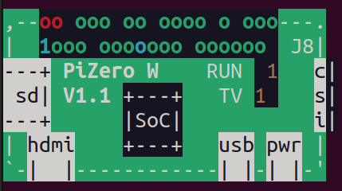
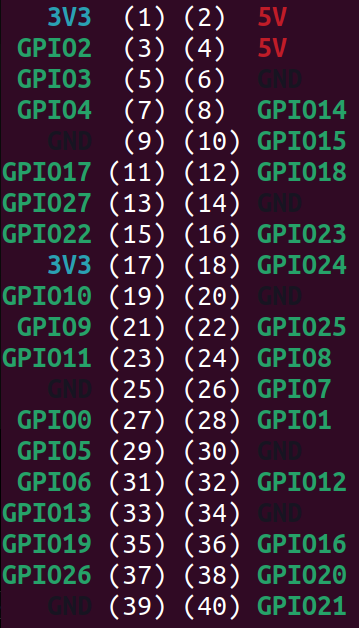

# TrainDisplay

## Android
The Android app is located under the ```build```directory.

## Raspberry Pi
In order to make this project runnable, the ```.ttf``` file from ```assets```has to be placed under ```/usr/local/share/fonts/```because that is one of the default paths where PIL is looking for font files. Furthermore, the file ```credentials.json``` has to be placed under ```/etc/train_display```. This file has the credentials to access the Deutsche Bahn API and has the following format:

```
{
   "id": <put id here>,
   "key": <put key here>
}
```
The following images show the pinout of the Raspberry Pi Zero W. 





This project was made to work with a Waveshare SPI display. In order to make this to work, connect it in the following way:

| Display    | Raspberry Pi |
| -------- | ------- |
| VCC      | 3V3     |
| GND      | GND     |
| DIN      | GPIO10  |
| CLK      | GPIO11  |
| CS       | GPIO08  |
| DC       | GPIO25  |
| RST      | GPIO24  |
| BL       | GPIO18  |
