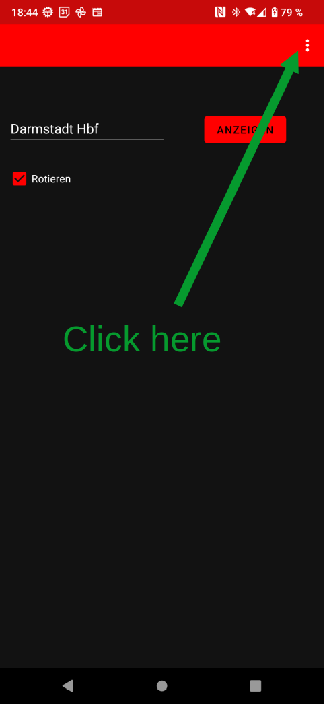
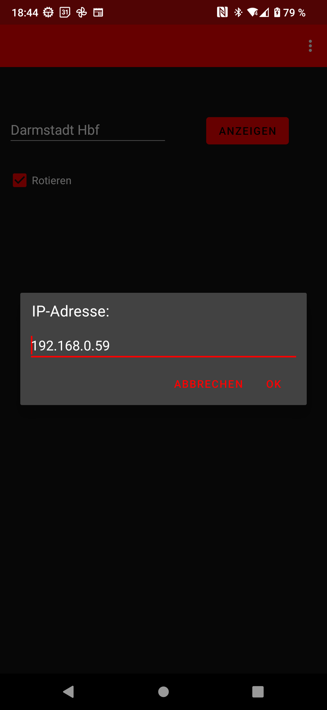

# TrainDisplay

## User documentation

### Android
The Android app is located under the ```build```directory. Inside the app, the IP address of the Raspberry Pi has to be set. 

<p float="left">
  
   
</p>


### Raspberry Pi

A cronjob was created in order to regularly update the display (in this case every 5 minutes) and display a timetable right after boot. Execute ```crontab -e``` and add the following line:

```
*/5 * * * * /home/pi/.venvs/py311_train_display/bin/python3 /home/pi/Projects/TrainDisplay/src/python/generate_timetable.py --from-config
@reboot /home/pi/.venvs/py311_train_display/bin/python3 /home/pi/Projects/TrainDisplay/src/python/generate_timetable.py --from-config
```

If the display should be updated every 15 minutes instead of every 5 minutes just change the ```*/5```to ```*/15```. 

<br/><br/>

The following images show the pinout of the Raspberry Pi Zero W. 


This project was made to work with a Waveshare SPI display. In order to make this to work, connect it in the following way:

| Display    | Raspberry Pi |
| -------- | ------- |
| VCC      | 3V3     |
| GND      | GND     |
| DIN      | GPIO10  |
| CLK      | GPIO11  |
| CS       | GPIO08  |
| DC       | GPIO25  |
| RST      | GPIO24  |
| BL       | GPIO18  |

## Troubleshooting 

Please try the following steps before reporting an error to me (looking at you Dad)

1. In a browser, input the following URL:
```
http://<IP address of the Raspberry Pi>:8000/generate_timetable?eva_nr=8000019&rotate=0
````
If a message like "Generated successful" appears, everything is right with the Pi and something is wrong with the App. Did you input the right IP address?

2. Login on the Pi (using Putty for example) and run ```sudo systemctl status webserver```.
3. hfghf


## Dev documentation

### Raspberry Pi

In order to make this project runnable, the ```.ttf``` file from ```assets```has to be placed under ```/usr/local/share/fonts/```because that is one of the default paths where PIL is looking for font files. Furthermore, the file ```credentials.json``` has to be placed under ```/etc/train_display```. This file has the credentials to access the Deutsche Bahn API and has the following format:

```
{
   "id": <put id here>,
   "key": <put key here>
}
```
The file ```webserver.service``` (under ```src/misc```) also has to be placed under ```/etc/systemd/system/webserver.service```. It will automatically start after boot. 
The SPI interface is not enables by default. Run ```sudo raspi-config``` and under ```Interface Options``` choose ```SPI```and enable it there. 
